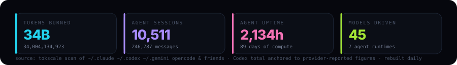
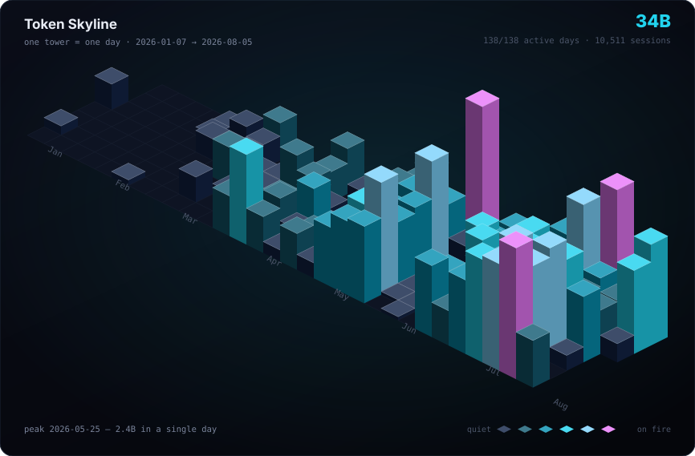
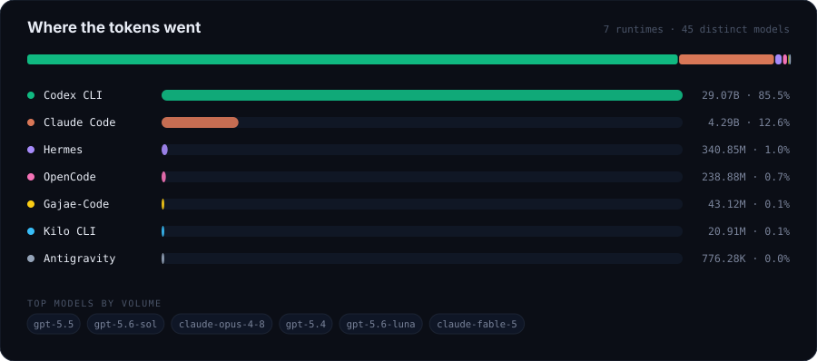
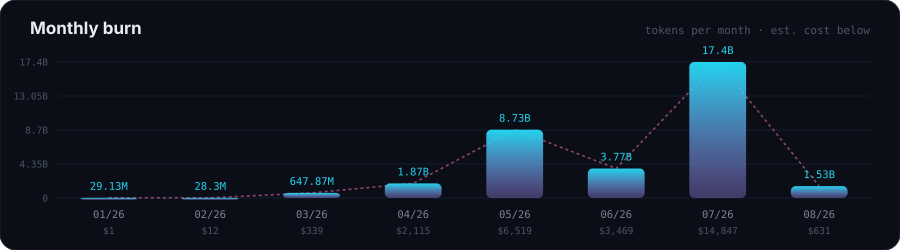

<div align="center">



</div>



---

### 🏙️ Token Skyline

Every tower is one real day of agent work. No estimates, no vibes — parsed straight out of
`~/.claude`, `~/.codex`, `~/.gemini`, OpenCode's store and five other runtimes.

<div align="center">



</div>





---

### 📐 How these numbers are made

Most profile badges are decoration. These are an audit.

```bash
bash scripts/refresh.sh    # scan every agent store, merge, rebuild every SVG
```

- **Daily shape is measured.** Per-message token counts are read out of local session logs —
  input, output, cache-read and cache-write counted separately, then summed. 6,872 Codex rollout
  files across two directories, 496 Claude Code transcripts, plus OpenCode, Hermes, Kilo,
  Gajae-Code and Antigravity stores. Session IDs across directories are disjoint, so nothing is
  counted twice.
- **96.53% of the Codex figure is that measured data.** OpenAI reports 29.07B lifetime tokens
  across the two accounts; local logs independently account for 28.06B of it, day by day. The
  remaining **3.47% has no local source left** — those sessions were pruned before they were ever
  scanned, and there is no per-day API to recover them — so that residual is spread across days in
  proportion to measured activity. Exact figures and the reasoning:
  [`data/overrides.json`](./data/overrides.json).
- **Cost is an estimate** from public per-model pricing, not a bill. Order of magnitude, not an
  invoice.
- Every SVG is generated by [`scripts/build_assets.py`](./scripts/build_assets.py) from
  `data/graph.json`. Nothing in this README is hand-typed — change the data, the picture changes.

<details>
<summary><b>Raw totals</b></summary>

<br>

<!-- STATS:START -->

| | |
|---|---|
| Window | `2026-01-07 → 2026-08-05` (138 days, **138 active**) |
| Tokens | **34,004,134,923** |
| Messages | 246,787 |
| Sessions | 10,511 |
| Agent uptime | 2,134 h — about **89 days** of compute inside 138 calendar days |
| Longest unbroken run | 146.7 h |
| Peak concurrency | 22 sessions at once |
| Biggest single day | `2026-05-25` — 2.4B tokens |
| Distinct models | 45, across 7 runtimes |

<sub>Generated by <code>scripts/build_assets.py</code> — do not edit by hand.</sub>

<!-- STATS:END -->

Machine-readable: [`data/stats.json`](./data/stats.json) · [`data/graph.json`](./data/graph.json)

</details>

---

### 🛠️ Building

| | |
|---|---|
| [**olli-interest-map**](https://github.com/inhodev/olli-interest-map) | 매주 꽂히는 게 바뀌어서, 아예 지도로 만든 관심맵 |
| [**safe_map**](https://github.com/inhodev/safe_map) | 인하대 안전지도 — D-UP contest |
| [**Library-of-Things**](https://github.com/inhodev/Library-of-Things) | 물건을 빌려 쓰는 도서관 · GDGoC × AZIT hackathon |
| [**copyvara-ai**](https://github.com/inhodev/copyvara-ai) · [**-fast**](https://github.com/inhodev/copyvara-fast) | Python 코어 + TypeScript 런타임 |
| [**insta-ripper**](https://github.com/inhodev/insta-ripper) | 로그인 없는 인스타 다운로더 (proxy) |
| [**myBIBLE**](https://github.com/inhodev/myBIBLE) | 나만의 성경앱 |

<sub>Dart · TypeScript · Python · JavaScript — whatever gets it shipped this week.</sub>

---

<div align="center">
<sub>
Inha University · Incheon, KR<br>
<i>The graph above is not a flex about spending. It's a log of how much of this was built by driving agents.</i>
</sub>
</div>
